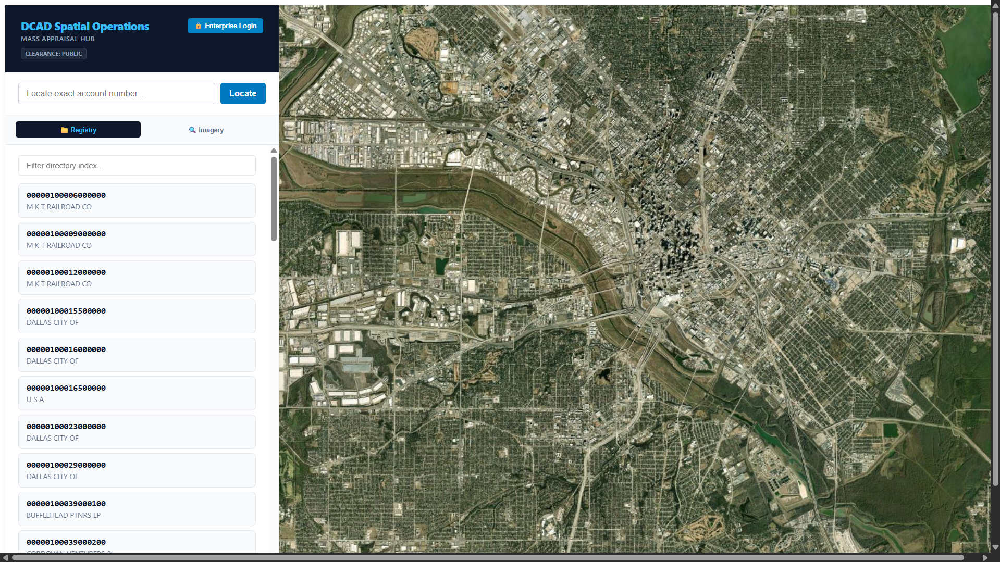
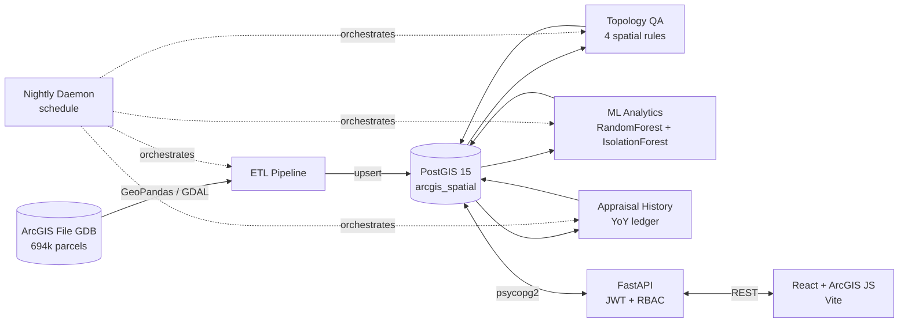
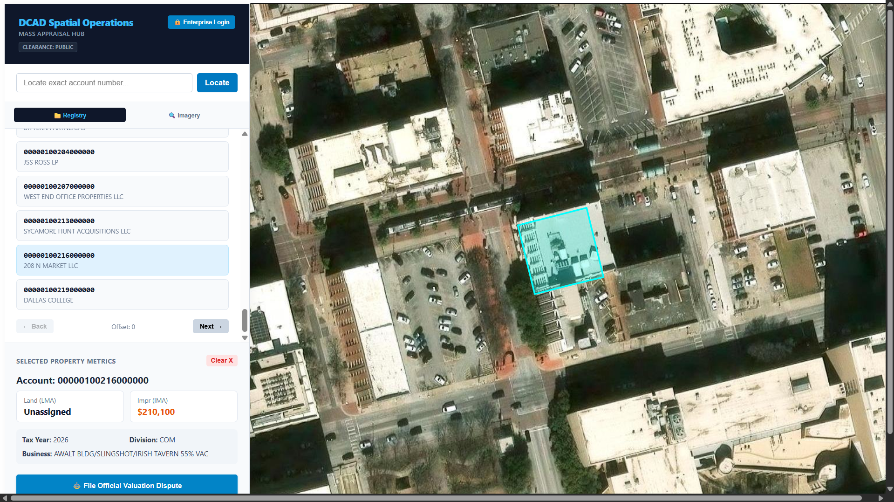
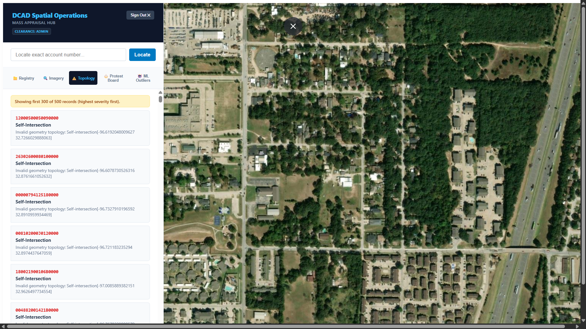
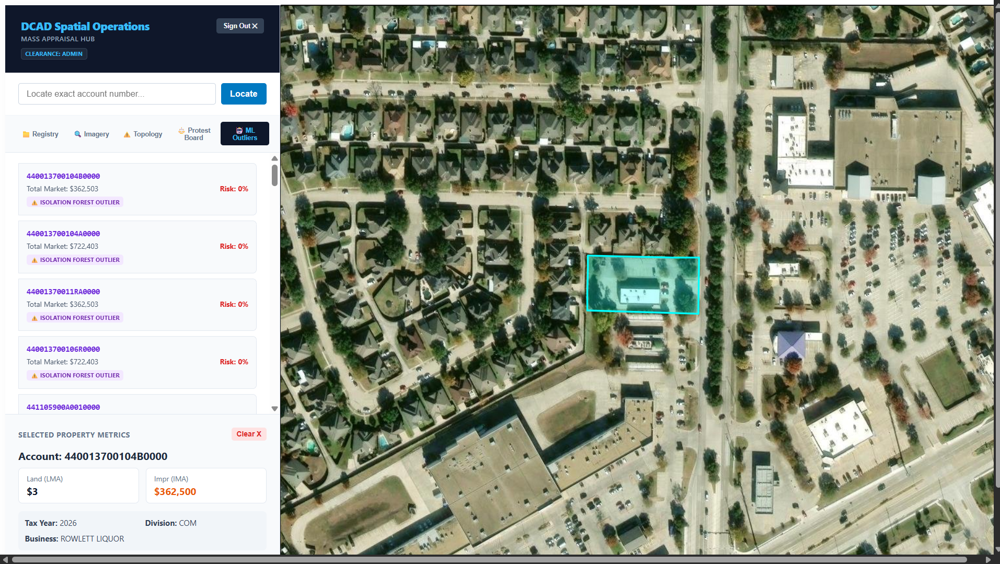
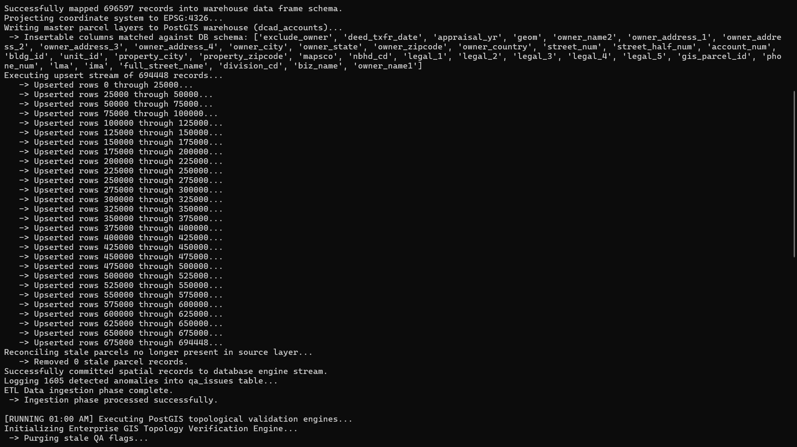

# Dallas County Appraisal District — GIS Data Platform

A full-stack geospatial data platform that ingests **694,000+ real Dallas County parcel records** into a PostGIS warehouse, runs a six-phase automated nightly pipeline (ETL → topology QA → change detection → ML scoring → history snapshots), and serves an interactive ArcGIS-powered map with role-based workflows for appraisers, analysts, GIS editors, and public citizens.

> **Disclaimer:** Personal portfolio project built on public DCAD open data. Not affiliated with or endorsed by the Dallas Central Appraisal District.



---

## Architecture



Four Docker services: **postgis** (spatial warehouse), **api** (FastAPI), **automation-daemon** (scheduled pipeline), **frontend** (React + ArcGIS Maps SDK).

## The Nightly Pipeline

| Time  | Phase | What it does |
|-------|-------|--------------|
| 00:00 | **Ingestion** | Reads the file geodatabase with GeoPandas, validates geometry/attributes, reprojects to EPSG:4326, and **upserts** ~694k parcels (`ON CONFLICT DO UPDATE`) so child tables survive refreshes; reconciles parcels removed from source |
| 01:00 | **Topology QA** | Four PostGIS rules — overlaps (`ST_Overlaps`), multi-part geometries, sliver gaps (sanitized `ST_Union` envelope differencing), self-intersections (`ST_IsValid`) — each isolated in its own transaction; violations logged to a severity-ranked QA queue |
| 02:00 | **Change Detection** | Intersects detected imagery variances with parcel boundaries and dispatches field-inspection workflows *(detection itself currently mocked — see Roadmap)* |
| 03:00 | **ML Scoring** | Schema-introspecting feature extraction (valuations, absentee ownership, corporate-entity flags, protest history) feeding a RandomForest protest-risk model and an IsolationForest valuation-anomaly detector; scores written back to the warehouse |
| 04:00 | **History Snapshot** | Appends one ledger row per (account, appraisal year) with computed year-over-year value change percentages — idempotent via unique index |
| 05:00 | **Cache Refresh** | Dashboard metric refresh *(stub — see Roadmap)* |

Run the whole sequence on demand:

```bash
docker compose run --rm automation-daemon python api/cron_nightly_pipeline.py --now
```

## Key Engineering Decisions

- **Upsert over truncate.** The loader originally used `TRUNCATE ... CASCADE`, which silently wiped the protest and history tables (FK cascade) every night. Rewritten as a chunked `ON CONFLICT DO UPDATE` stream with stale-row reconciliation — longitudinal data now survives refreshes.
- **Schema-introspecting ETL & ML.** Both the loader and the feature extractor query `information_schema` and adapt to the columns that actually exist, with loud warnings on drift — no more silent data loss when source exports change shape.
- **Defensive valuation handling.** `lma`/`ima` are stored as text by design (DCAD uses statuses like `UNASSIGNED`); every consumer — ML, history, API, frontend — coerces defensively instead of crashing on non-numeric values.
- **Geometry sanitization before union.** County-wide `ST_Union` on raw parcel fabric throws GEOS `TopologyException`s; the gaps rule repairs (`ST_MakeValid`), snaps (`ST_SnapToGrid`), and buffers before unioning.
- **Bounded dashboards.** QA endpoints cap and severity-rank results; the frontend hard-caps rendered cards — a county's worth of topology violations can't freeze the browser.
- **RBAC at the API.** JWT-authenticated roles (admin, analyst, appraiser, GIS editor, public citizen) gate every dashboard and workflow; protest filing is restricted to authenticated public citizens and fully audit-logged.

## Database Schema (core tables)

| Table | Purpose |
|---|---|
| `dcad_accounts` | Master parcel record: ownership, situs address, legal description, valuations, `geometry(MultiPolygon, 4326)` with GiST index |
| `qa_issues` | Topology/attribute violations with severity, status, and resolution workflow |
| `protests` | Citizen appraisal protests (FK → accounts) with evaluation lifecycle |
| `appraisal_history` | Year-over-year valuation ledger, unique per (account, year) |
| `ml_analytics_outputs` | Protest-risk scores + anomaly flags per parcel |
| `change_detections` | Imagery-variance findings pending field inspection |

Full DDL in [`db/schema.sql`](db/schema.sql).

## Screenshots

| | |
|---|---|
|  |  |
| Parcel selection with valuation metadata | Severity-ranked topology violation queue |
|  |  |
| Isolation Forest valuation outliers | Full nightly pipeline executing |

🎥 **[Watch the 5-minute walkthrough on Loom](PASTE_LOOM_LINK_HERE)**

## Tech Stack

**Backend:** Python 3.10, FastAPI, SQLAlchemy 2.0, psycopg2, GeoPandas/GDAL, scikit-learn, PyJWT
**Database:** PostgreSQL 15 + PostGIS 3.4
**Frontend:** React 18, ArcGIS Maps SDK for JavaScript 4.29, Vite, Tailwind
**Infra:** Docker Compose (4 services), scheduled daemon orchestration

## Getting Started

```bash
git clone https://github.com/YOUR_USERNAME/dcad-appraisal-gis.git
cd dcad-appraisal-gis
cp .env.example .env          # set POSTGRES_PASSWORD and JWT_SECRET
docker compose up -d postgis
docker exec -i dcad_postgis_warehouse psql -U postgres -d arcgis_spatial < db/schema.sql
docker compose up -d --build
```

- Frontend: http://127.0.0.1:3000 · API docs: http://127.0.0.1:8000/docs

**Parcel data is not included in this repository** (≈300 MB file geodatabase, excluded via `.gitignore`). Download the parcel/account extracts from the [DCAD open data portal](https://www.dallascad.org), build the joined geodatabase layer, and place it at `etl/data/tablejoiner/tablejoiner.gdb` (layer `dcad_parcels`), then trigger the pipeline with `--now` as shown above. The application runs without data — the map and dashboards simply start empty.

## Roadmap

- Replace mocked NAIP imagery change detection with real raster differencing
- Implement the 05:00 dashboard cache materialization (currently a stub)
- Populate year-over-year ML trend features from the history ledger once multiple appraisal years accumulate
- Server-side pagination + filtering for the QA queue beyond the current 500-row severity cap
